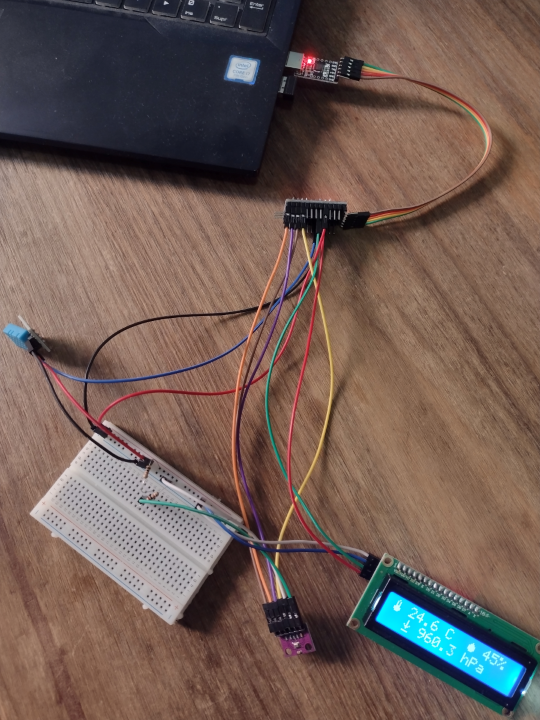
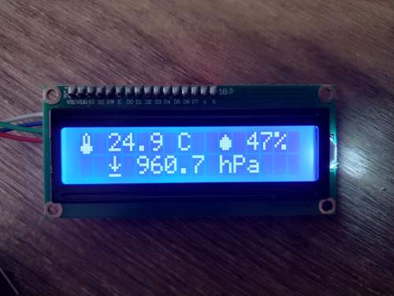

## Modules implemented

### Arduino:
- Arduino Pro-Mini 5V
- Module CP2102: UBS to serial TTL converter (for code upload)

### Modules/Sensors:
- Module DHT11: Temperature and humidity sensor.
- Module BMP280: Temperature and atmospheric pressure sensor
- LCD Display 16x2 with I2C interface module (Inter-Integrated Circuit).

### Extras:
- Dupont wires:
  - F-F: 7
  - M-F: 8 
  - M-M: 0
- Resistors:
  - 1 of 10 kOhm.
  - 1 of 20 kOhm.

## Pictures

- **Complete network:**
  
  
  
- **LCD output:**
  
  