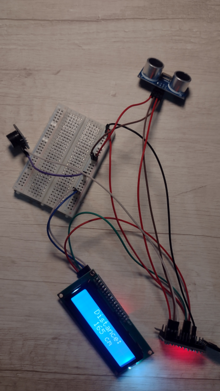
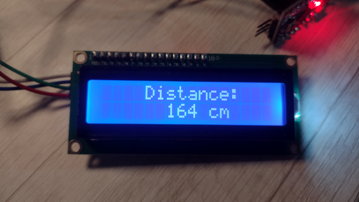
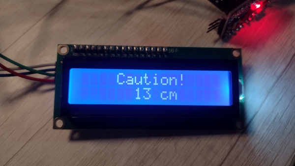
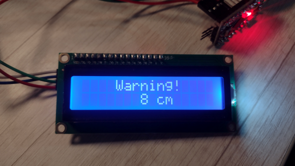

## Modules implemented

#### Arduino:
- Arduino Pro-Mini 5V
- Module CP2102: UBS to serial TTL converter (for code upload)

#### Modules/Sensors:
- LCD Display 16x2 with I2C interface module (Inter-Integrated Circuit).
- TBD

#### Extras:

- Dupont wires: TBD

## Pictures

1. **Whole network:**

_Click to expand_

2. **Distance output:**

_Click to expand_

3. **Caution output:**

_Click to expand_

4. **Warning output:**

_Click to expand_

